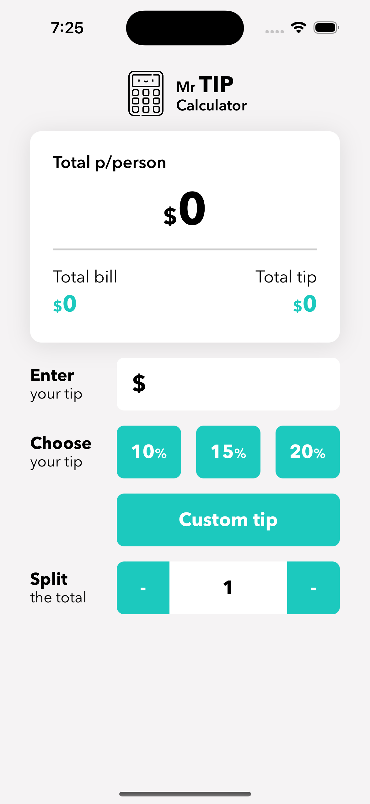

# Tip Calculator Application

<p align="center">
	
</p>

Welcome to the Tip Calculator application! This simple yet handy tool allows you to effortlessly calculate tips based on various percentages and split the total bill among a specified number of people. Whether you're dining out with friends, grabbing coffee, or enjoying a meal with family, the Tip Calculator has got you covered.

## Features

- Calculate tips quickly and accurately with just a few taps.
- Choose from predefined tip percentages: 5%, 10%, 15%, and 20%.
- Utilize the custom tip option to enter a specific percentage that suits your preferences.
- Split the total bill among any number of people, ensuring fair cost distribution.
- Real-time updates as you adjust tip percentages, total amount, and number of people.

## How to Use

1. Enter the **total bill amount** in the designated field.
2. Select the desired **tip percentage**:
   - Tap one of the predefined tip percentage buttons (10%, 15%, or 20%).
   - To set a custom tip percentage, choose the "Custom" option and input the percentage.
3. Specify the **number of people** sharing the bill by clicking the "Split" button and entering the count.
4. Instantly view the calculated **tip amount** and the **total amount**, including the tip.
5. The **amount per person** after splitting the bill will also be displayed.

## Getting Started

To use the Tip Calculator locally on your machine, follow these steps:

1. Clone this repository to your local machine using the following command:

   ```bash
   git clone https://github.com/your-username/tip-calculator.git

   1. **Navigate to the project directory:**

   cd tip-calculator

   open Xcode project
   ```

## Contributing

Contributions are welcome! If you'd like to enhance the Tip Calculator or fix any issues, please follow these steps:

1. Fork the repository to your GitHub account.
2. Create a new branch from the main branch with a descriptive name:

	```bash
	git checkout -b feature/new-feature
	```
3. Make your desired changes and improvements.
4. Commit your changes with clear commit messages:

	```bash
	git commit -m "Add feature: description of your changes"
	```
5. Push your changes to your forked repository:
	```bash
	git push origin feature/new-feature
	```
6. Open a Pull Request on the official repository, providing details about your changes.

## License

This project is licensed under the [MIT License](LICENSE), which allows you to freely use, modify, and distribute the software.

---

**Enjoy hassle-free bill splitting and accurate tip calculations with the Tip Calculator app! If you encounter any issues or have suggestions, feel free to create an issue or contribute to the project. Happy dining!** 🍽️🔢💰


